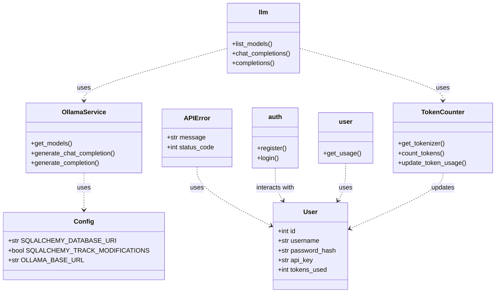

# LLM SaaS API

This is a Flask project using SQLAlchemy for database management and Bcrypt for password encryption. The project includes configuration for an OpenAI-compatible API that interacts with the Ollama API, enabling the use of any model available on the Ollama site.

## Class Diagram



## Virtual Environment Setup

To create and activate a Python virtual environment, follow these steps:

1. **Create a virtual environment:**

   ```bash
   python -m venv venv
   ```

2. **Activate the virtual environment:**

   - On Windows:

     ```bash
     venv\Scripts\activate
     ```

   - On macOS and Linux:

     ```bash
     source venv/bin/activate
     ```

3. **Install dependencies:**

   With the virtual environment activated, install the dependencies listed in `requirements.txt`:

   ```bash
   pip install -r requirements.txt
   ```

## Configuration

1. **Environment Setup**

   Create a `.env` file in the root of the project and add the following environment variable:

   ```
   OLLAMA_BASE_URL=http://localhost:11434
   ```

   This URL is used to connect to the Ollama API.

2. **Database**

   The project uses SQLite for data storage. The database will be created automatically on the first run of the application.

## Project Structure

- `app.py`: Configures the Flask application and registers the route blueprints.
- `config.py`: Contains application configuration, including database and Ollama base URL.
- `models.py`: Defines the `User` model for the database.
- `utils/extensions.py`: Contains `db` and `bcrypt` initialization.
- `utils/decorators.py`: Contains decorators for API key validation and error handling.
- `routes/`: Directory containing blueprints for `auth`, `llm`, and `user` routes.
- `services/`: Directory containing services for interacting with the Ollama API and token counting.

## Routes

### Auth

- **`POST /register`**: Registers a new user. Requires `username` and `password` in the request body. Returns an `api_key` for the registered user.
- **`POST /login`**: Logs in an existing user. Requires `username` and `password` in the request body. Returns the user's `api_key` if credentials are valid.

### LLM

- **`GET /v1/models`**: Lists all available models. Requires a valid API key in the request header.
- **`POST /v1/chat/completions`**: Generates a response for a conversation based on the provided `messages` and `model`. Supports response streaming.
- **`POST /v1/completions`**: Generates a text completion for a prompt based on the provided `model`.

### User

- **`GET /user/usage`**: Returns the token usage of the authenticated user. Requires a valid API key in the request header.

## Services

### `ollama_service`

- **`get_models()`**: Retrieves the list of available models from the Ollama API.
- **`generate_chat_completion(model, prompt, data, stream=False)`**: Generates a chat response for the given model and prompt. Supports response streaming.
- **`generate_completion(model, prompt, data)`**: Generates a text completion for the given model and prompt.

### `token_counter`

- **`get_tokenizer(model_name)`**: Gets the tokenizer for the specified model, using a default fallback.
- **`count_tokens(text, model_name)`**: Counts the number of tokens in the provided text using the model's tokenizer.
- **`update_token_usage(user, token_count)`**: Updates the user's token usage in the database.

## Utilities

### `utils/decorators`

- **`require_api_key(view_function)`**: Decorator that ensures the request contains a valid API key. Returns a 401 error if the key is missing or invalid.

### `utils/extensions`

- **`db`**: SQLAlchemy instance for database management.
- **`bcrypt`**: Bcrypt instance for password encryption.

## Running the Project

To start the Flask server, run the following command:

```bash
python app.py
```

The app will start in development mode and be available at `http://127.0.0.1:5000`.

## Database Structure

The data model is defined in `models.py` and includes the `User` table with the following fields:

- `id`: Unique identifier for the user.
- `username`: Unique username.
- `password_hash`: Hashed password for the user.
- `api_key`: Unique API key for the user.
- `tokens_used`: Number of tokens used by the user.

## SSL Renewal

```Bash
# To generate the certificate:
sudo certbot certonly --webroot --webroot-path=/home/tensordock/projects/llm_saas_api/webroot --email your-email@gmail.com --agree-tos --no-eff-email -d your-domain.com

# To copy the certificate to the project folder
sudo cp /etc/letsencrypt/live/your-domain.com/fullchain.pem /home/tensordock/projects/llm_saas_api/ssl/fullchain.pem
sudo cp /etc/letsencrypt/live/your-domain.com/privkey.pem /home/tensordock/projects/llm_saas_api/ssl/privkey.pem
```

## Contributing

If you want to contribute to this project, feel free to submit a pull request or open an issue.

## License

This project is licensed under the [MIT License](LICENSE).

## Contact

For more information, contact [Claudio Cassimiro](mailto:claudioletras2019@gmail.com).

---

# LLM API - Documentação em Português

Este é um projeto Flask que utiliza SQLAlchemy para gerenciamento de banco de dados e Bcrypt para criptografia de senhas. O projeto inclui uma configuração para uma API OpenAI Compatible que interage com a API da Ollama, possibilitando a utilização de qualquer modelo disponível no site da Ollama.

## Diagrama de Classes


## Configuração do Ambiente Virtual

Para criar e ativar um ambiente virtual Python, siga estes passos:

1. **Crie um ambiente virtual:**

   ```bash
   python -m venv venv
   ```

2. **Ative o ambiente virtual:**

   - No Windows:

     ```bash
     venv\Scripts\activate
     ```

   - No macOS e Linux:

     ```bash
     source venv/bin/activate
     ```

3. **Instale as dependências:**

   Com o ambiente virtual ativado, instale as dependências listadas em `requirements.txt`:

   ```bash
   pip install -r requirements.txt
   ```

## Configuração

1. **Configuração do Ambiente**

   Crie um arquivo `.env` na raiz do projeto e adicione a seguinte variável de ambiente:

   ```
   OLLAMA_BASE_URL=http://localhost:11434
   ```

   Este URL é utilizado para se conectar à API da Ollama.

2. **Banco de Dados**

   O projeto utiliza SQLite para armazenamento de dados. O banco de dados será criado automaticamente na primeira execução do aplicativo.

## Estrutura do Projeto

- `app.py`: Configura a aplicação Flask e registra os blueprints das rotas.
- `config.py`: Contém a configuração do aplicativo, incluindo a URL do banco de dados e a URL base da Ollama.
- `models.py`: Define o modelo `User` para o banco de dados.
- `utils/extensions.py`: Contém a inicialização do `db` e `bcrypt`.
- `utils/decorators.py`: Contém decoradores para validação de API key e manipulação de erros.
- `routes/`: Diretório contendo os blueprints para as rotas `auth`, `llm` e `user`.
- `services/`: Diretório contendo os serviços para interação com a API da Ollama e contagem de tokens.

## Rotas

### Auth

- **`POST /register`**: Registra um novo usuário. Exige `username` e `password` no corpo da requisição. Retorna um `api_key` para o usuário registrado.
- **`POST /login`**: Realiza login de um usuário existente. Exige `username` e `password` no corpo da requisição. Retorna o `api_key` do usuário se as credenciais forem válidas.

### LLM

- **`GET /v1/models`**: Lista todos os modelos disponíveis. Exige uma chave API válida no cabeçalho da requisição.
- **`POST /v1/chat/completions`**: Gera uma resposta para uma conversa com base nos `messages` e no `model` fornecido. Suporta streaming de respostas.
- **`POST /v1/completions`**: Gera uma conclusão para um prompt de texto com base no `model` fornecido.

### User

- **`GET /user/usage`**: Retorna o uso de tokens do usuário autenticado. Exige uma chave API válida no cabeçalho da requisição.

## Serviços

### `ollama_service`

- **`get_models()`**: Recupera a lista de modelos disponíveis da API da Ollama.
- **`generate_chat_completion(model, prompt, data, stream=False)`**: Gera uma resposta de chat para o modelo e prompt fornecidos. Suporta streaming de respostas.
- **`generate_completion(model, prompt, data)`**: Gera uma conclusão de texto para o modelo e prompt fornecidos.

### `token_counter`

- **`get_tokenizer(model_name)`**: Obtém o tokenizer para o modelo especificado, usando um fallback padrão.
- **`count_tokens(text, model_name)`**: Conta o número de tokens no texto fornecido usando o tokenizer do modelo.
- **`update_token_usage(user, token_count)`**: Atualiza o uso de tokens do usuário no banco de dados.

## Utilitários

### `utils/decorators`

- **`require_api_key(view_function)`**: Decorador que garante que a requisição contenha uma chave API válida. Se a chave estiver ausente ou inválida, retorna um erro 401.

### `utils/extensions`

- **`db`**: Instância do SQLAlchemy para gerenciamento do banco de dados.
- **`bcrypt`**: Instância do Bcrypt para criptografia de senhas.

## Executando o Projeto

Para iniciar o servidor Flask, execute o seguinte comando:

```bash
python app.py
```

O aplicativo será iniciado em modo de desenvolvimento e estará disponível em `http://127.0.0.1:5000`.

## Estrutura do Banco de Dados

O modelo de dados é definido em `models.py` e inclui a tabela `User` com os seguintes campos:

- `id`: Identificador único do usuário.
- `username`: Nome de usuário único.
- `password_hash`: Hash da senha do usuário.
- `api_key`: Chave API única para o usuário.
- `tokens_used`: Número de tokens usados pelo usuário.

## Renovação do SSL

```Bash
# Para gerar o certificado:
sudo certbot certonly --webroot --webroot-path=/home/tensordock/projects/llm_saas_api/webroot --email your-email@gmail.com --agree-tos --no-eff-email -d your-domain.com

# Para copiar o certificado para a pasta do projeto
sudo cp /etc/letsencrypt/live/your-domain.com/fullchain.pem /home/tensordock/projects/llm_saas_api/ssl/fullchain.pem
sudo cp /etc/letsencrypt/live/your-domain.com/privkey.pem /home/tensordock/projects/llm_saas_api/ssl/privkey.pem
```

## Contribuindo

Se você deseja contribuir para este projeto, sinta-se à vontade para enviar um pull request ou abrir uma issue.

## Licença

Este projeto está licenciado sob a [MIT License](LICENSE).

## Contato

Para mais informações, entre em contato com [Claudio Cassimiro](mailto:claudioletras2019@gmail.com).
